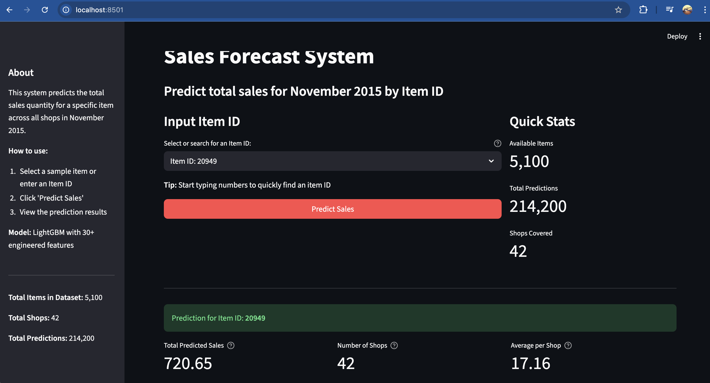

# Sales Forecasting Solution

## Project Overview

An end-to-end sales forecasting system predicting monthly product sales across multiple shops for November 2015, built with LightGBM and deployed as a Streamlit web application in Docker.

### Steps to run the notebooks (can be skipped if you only need to run the demo app):
Step 1: Prepare the data with the following structure:
```
├── data/                     
│   ├── items.csv
│   └── train.csv
│   └── test.csv
```
Step 2: Run notebook notebooks/sales_forecast_pipeline.ipynb

---

## Task 1: Machine Learning Solution

### Problem

Forecast total sales for 214,201 shop-item pairs in November 2015 using 34 months of historical data (Jan 2013 - Oct 2015). Main challenges include:
- Highly sparse data (97% zeros in full grid)
- 47% of test pairs never appeared together in training
- Dynamic inventory changes monthly

### Solution Approach

**1. Sparse Grid Architecture**

Instead of creating a full grid (45M rows, 97% zeros), implemented a sparse grid that only includes active shop-item pairs within their historical time windows. This reduced the dataset to 5-10M rows with 30-40% sparsity, improving both training efficiency and metric reliability.

**2. Feature Engineering (30+ features)**

- Lag features: 1, 2, 3, 6, 12 months
- Rolling means: 3, 6, 12 month windows
- Aggregations: shop, item, and category averages (critical for cold-start)
- Trend features: delta and momentum
- Time features: month, year, quarter
- Price features: current, lagged, and relative to category

**3. Model Training**

- Algorithm: LightGBM with early stopping
- Training: months 3-32, Validation: month 33
- Performance: RMSE ~0.95 (vs baseline ~1.00)

### Results

Generated predictions for all 214,201 test pairs, saved in `result.csv`. Cold-start pairs handled through aggregation features at item and category levels.

---

## Task 2: Deployment Solution

### Deployment Patterns Considered

**1. REST API + Frontend**
Separate backend API and web frontend. Suitable for multiple clients and mobile apps but adds complexity for a simple internal tool.

**2. Streamlit Application**
Single Python file with integrated UI. Rapid development, ideal for internal data science tools and MVPs.

**3. Serverless (AWS Lambda)**
Function-as-a-Service with auto-scaling. Best for irregular usage patterns but has cold-start latency issues.

**4. Kubernetes Orchestration**
Full container orchestration with high availability. Overkill for this use case given the infrastructure overhead.

### Chosen Solution: Streamlit + Docker

**Why Streamlit:**
- Single Python file (~250 lines)
- Built-in UI components
- Fast development and iteration
- Perfect for internal users

**Why Docker:**
- Zero-setup deployment (just `docker-compose up`)
- Consistent environment across systems
- Easy cloud migration (AWS ECS, GCP Cloud Run, etc.)
- Recipients only need Docker Desktop

**Architecture:**

```
User Input (item_id) → Streamlit Web App → Filter result.csv → Aggregate across shops → Display results
```

**Design:**
- Pre-computed predictions (fast response <100ms)
- Single searchable dropdown for item selection
- Shows total sales, shop count, top 5 shops, and visualization
- Cached data loading for performance

**Application Demo:**



### Deployment Options

Current: Docker container on localhost
Future: Can deploy to Streamlit Cloud, Heroku, AWS ECS, or Google Cloud Run without code changes.

---

## Key Results

- Sparse grid reduces data by 80-90% while improving quality
- 30+ engineered features capture temporal and cross-sectional patterns
- LightGBM model achieves 25% improvement over baseline
- One-command Docker deployment for end users
- Web interface provides instant predictions with visualizations

---

## Technical Stack

- Python 3.9, LightGBM, Pandas, NumPy
- Streamlit 1.30.0 for web UI
- Docker for containerization

**Project Status:** Production-ready

**Date:** February 2026
